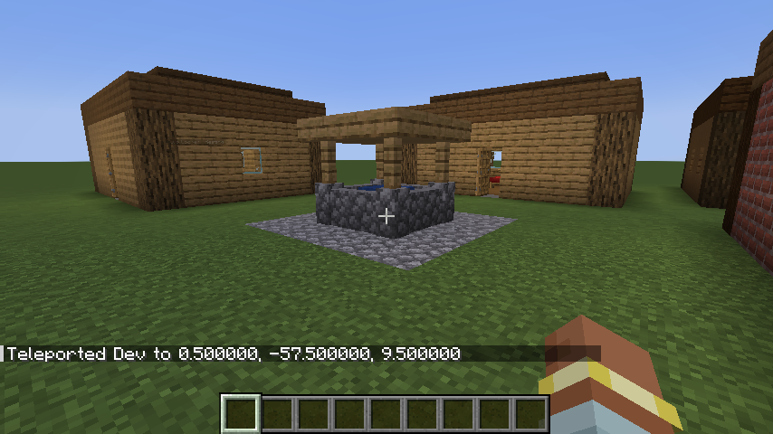
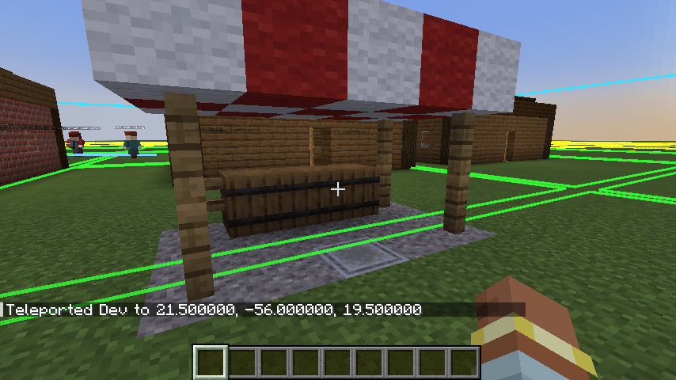

# Villager Simulator

A NeoForge 1.21.1 mod: a village simulation engine aiming at a million villagers, with daily lives that keep going when you walk away.

- [docs/DESIGN.md](docs/DESIGN.md): what the game is
- [docs/ARCHITECTURE.md](docs/ARCHITECTURE.md): how it's built
- [docs/ROADMAP.md](docs/ROADMAP.md): the phases. **Implemented: Phase 0 (A Living Hamlet), Phase 1 (Smart Objects & Choices), Phase 2 (Venues & Relationships), Phase 3 (The Player Joins the Village), Phase 4 (Villagers With a Face), Phase 5 (Districts & Seamless Tiers), Phase 6 (Scale Gate).**

## Project layout

| Project | What it is |
|---|---|
| `sim-api` | Public, Minecraft-free contracts: entities, components, tasks, events, registries, activities, views, modules |
| `sim-core` | The engine: storage, event scheduler, runtime thread, SQLite persistence |
| `sim-content` | Base game modules (needs, buildings, villages, plans), built only on `sim-api` |
| `sim-harness` | Headless scenario DSL; scenario tests run in virtual time |
| `sim-bench` | The 1M-villager scale benchmark and JMH micro-benchmarks ([docs/SCALE.md](docs/SCALE.md)) |
| `neoforge` | The mod: bridge, villager puppets, blueprints, `/vs` commands, GameTests |
| `tools/blueprints` | Structure Lab scripts that generate the blueprints and their building-type JSON |

## Build and test

```bash
./gradlew build
```

Runs the unit and scenario tests (headless, seconds) and builds `neoforge/build/libs/villagersimulator-<version>.jar`.

```bash
./gradlew :neoforge:runGameTestServer
```

Runs the GameTests. Pick namespaces with `-PvsGameTestNamespaces=villagersimulator_bridge` (or `villagersimulator_time`).

```bash
./gradlew checkDependencyRules
```

Checks the project dependency rules from ARCHITECTURE §4.

Regenerate blueprints after editing `tools/blueprints/blueprints.py`:

```bash
D:/MinecraftMods/MinecraftStructureInjector/.venv/Scripts/python.exe tools/blueprints/blueprints.py
```

## Play Phase 0

```bash
./gradlew :neoforge:runClient
```

In a creative overworld (cheats on):

- `/vs village spawn [villagers] [name]` founds a hamlet around you: a well, a bakery and houses, with 8 villagers by default. They sleep, eat at the bakery, bake, and relax at the well on a daily schedule.
- `/vs inspect [villager]` shows the nearest villager's needs, plan and recent events. Right-clicking a building's anchor block shows the building and its stock.
- `/vs village list` lists villages.
- `/vs time warp <1d|6h|30m|200t>` runs the sim ahead; `/vs time status` shows the clock.
- `/vs tier force all <t0|t2|auto>` forces tiers, for debugging.
- `/vs expr eval <expression>` evaluates a VS expression, e.g. `need('social') < 30 && hour() > 12`, with the nearest villager as the actor.
- `/vs problems` lists data problems (bad definitions, expressions that don't compile). Bad data is skipped, not fatal.
- `/vs save` saves the sim now; it also saves with the world.

**Villagers choose what to do.** Outside sleep and work, villagers pick from what buildings advertise: the bakery (eat), tavern (drink), well (gather, wash), market stall (browse) and their home (rest, nap), scored by their six needs (hunger, energy, social, fun, hygiene, comfort). Building types and their advertisements are datapack JSON (`data/<ns>/villagersimulator/building_types/`); `/reload` applies changes to the running sim. Beds and vanilla workstation blocks in a blueprint become points automatically.

**Villagers know each other.** Whenever villagers spend time at the same place (chatting at the well, drinking at the tavern, working the same shift), their friendship changes, shaped by kindness, temper and sociability. Friends and rivals form, colleagues bond, arguments leave memories that fade over a day or two. Close friends arrange to meet at the tavern the next evening; rivals avoid places the other is at. Embodied villagers face whoever they're talking to. `/vs inspect` shows personality, mood, relationships, memories and appointments.

**You're part of it too.** Right-click a villager to talk: chat, compliment, joke, ask about their day, or invite them to the tavern (once they know you). Use an item on a villager to give it as a gift; what it's worth depends on the item (`gift_values` data) and the villager's taste. Spending time in the tavern or at the well with villagers builds relationships the same way it does between villagers, and villagers gossip about you, so your reputation spreads to people you've never met. `/vs reputation` shows where you stand.

**Every villager looks different.** Villagers are GeckoLib models (`tools/models/villager.py`) with idle, walk, work, eat, talk and sleep animations driven by what the sim says they're doing. Their look comes from appearance genes in the sim (skin, hair colour and style, outfit, eyes), painted into a texture on the client.



**Towns have districts.** `/vs village spawn` with more than 16 villagers lays out a two-district town (a residential quarter and a market quarter) joined by a road network; villagers walk along the roads. Each village simulates on its own thread, so many villages use many cores (`sim.workerThreads`).



**Seamless tiers.** Villagers within 48 blocks are embodied (T0), others in loaded chunks are T1, unloaded ones within 256 blocks are T2, and beyond that villages are simulated a day at a time (T3), unless a villager matters to a player (a friend, an appointment), in which case they're pinned to T2. Tier changes never teleport anyone: villagers appear where their schedule and route put them. `/vs debug overlay` draws chunk tiers (T0 green, T1 yellow, T2 orange, T3 red), district borders and walking routes.

Walk more than 48 blocks away and the villagers become abstract (T2) while their days carry on. Come back and they're where their schedule says. The sim is saved in `<world>/villagersimulator/sim.db`.

**Scale.** One million villagers simulate at 0.04% of real time in 763 MB ([docs/SCALE.md](docs/SCALE.md)). `/vs stress <villagers>` adds sim-only towns far away to try it in game, and `/vs profile [reset]` shows the server tick time, villagers per tier, and where the sim spends its time. Benchmarks: `./gradlew :sim-bench:scale` (1M villagers headless) and `./gradlew :sim-bench:jmh`.

**Config** (`config/villagersimulator-common.toml`): `sim.debugTimeScale` speeds up sim time for playtesting; `tiers.t0Radius` sets the embodiment distance, `tiers.t3Radius` the day-batch distance, `sim.workerThreads` the village threads.

**Visual check:** `./gradlew :neoforge:runClientScript` runs a scripted client (window off-screen) that builds a hamlet, takes screenshots into `neoforge/runs/clientscript/screenshots/` and quits.

**Hot-swap in dev:** `./gradlew :neoforge:runClient -Pvs_hotswap=true` runs on a JetBrains Runtime with enhanced class redefinition.

## License

[MIT](LICENSE).
