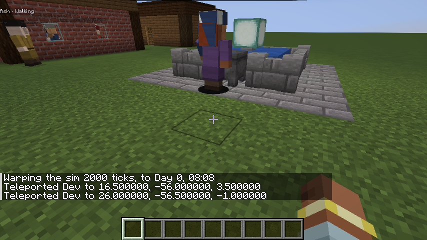

# Modding Villager Simulator

Villager Simulator is built to be extended ([ARCHITECTURE.md §8, §10, §11](ARCHITECTURE.md)). There are three ways in:

| You want to… | Use | Needs |
|---|---|---|
| Add buildings, change what villagers value, tune needs | **Data**: datapack JSON and VS expressions | Nothing |
| React to what villagers do, send commands, write test scenarios | **KubeJS** server scripts | KubeJS |
| Add new Activities, expression functions, behaviours up close, UI panels | A **Java addon** built on the public APIs | A NeoForge mod |

The reference addon, [`examples/fountain`](../examples/fountain), uses every extension point below. It is built in CI against the public APIs only.



## Public APIs

| Artifact | Package | What's in it |
|---|---|---|
| `villagersimulator-sim-api` (Minecraft-free) | `com.ewitulsk.villagersimulator.api.sim` | Sim modules, components, tasks, events and the event log, commands and queries, registries, activities, expressions, conditions/effects, stats, relationships, views, the scenario DSL |
| `villagersimulator-mod-api` (Minecraft side) | `com.ewitulsk.villagersimulator.api.mod` | Registering modules, sim events on the game bus, the running sim (`SimAccess`), embodied behaviours, animation keys, blueprint point blocks, dialogue panels, scenarios |

Everything else (`core`, `content`, `neoforge`, `compat`) is internal and may change at any time.

**Stability.** The APIs follow semantic versioning. Before 1.0, breaking changes are allowed but announced. CI compares both APIs with the baseline in `api/baseline/` using japicmp (`./gradlew apiCompatibility`) and fails on any binary- or source-incompatible change that isn't announced. A change is announced by updating the baseline in the same commit (`./gradlew updateApiBaseline`). Types marked `@ApiStatus.Experimental` may still change. `@ApiStatus.Internal` members are exempt from the check and are not for addons.

**Getting the APIs.** They aren't hosted yet ([ARCHITECTURE.md A23](ARCHITECTURE.md)). Either build your addon inside this repository, as `examples/fountain` does, or publish them locally:

```bash
./gradlew :sim-api:publishToMavenLocal :mod-api:publishToMavenLocal
```

Then use them from your addon's `build.gradle`. They are provided at runtime by Villager Simulator, so they are `compileOnly`:

```groovy
repositories { mavenLocal() }
dependencies {
    compileOnly 'com.ewitulsk.villagersimulator:villagersimulator-sim-api:0.1.0'
    compileOnly 'com.ewitulsk.villagersimulator:villagersimulator-mod-api:0.1.0'
}
```

Declare a required dependency on `villagersimulator` in your `neoforge.mods.toml`.

Javadoc: `./gradlew :sim-api:javadoc :mod-api:javadoc`. Expression functions: [EXPRESSIONS.md](EXPRESSIONS.md), generated from the code.

## Data: buildings and advertisements

A building type is `data/<ns>/villagersimulator/building_types/<name>.json` plus its blueprint `data/<ns>/structure/<name>.nbt`. It lists points (where people stand), what it offers (advertisements), and optionally a `layout`, which makes generated villages include it without code:

```json
{
  "blueprint": "villagersimulator_fountain:fountain",
  "size": [7, 3, 7],
  "points": { "wander": [[0, 1, 0], [3, 1, 0]], "anchor": [[0, 0, 0]] },
  "layout": { "per_villagers": 16, "district": "market" },
  "advertisements": [
    { "id": "wish", "activity": "villagersimulator_fountain:make_wish", "point": "wish", "duration": "30m",
      "needs": { "fun": 30, "social": 5 }, "score": "wishes() < 3 ? 15 : 0" }
  ]
}
```

Villagers score every advertisement they can reach against their needs, with `score` and `condition` expressions on top, and pick the best one ([DESIGN.md §9.1](DESIGN.md)). `/reload` applies data changes to the running sim, and `/vs problems` lists anything that didn't load.

Beds and vanilla workstation blocks inside a blueprint become points automatically. More blocks can be mapped to point kinds with `data/<ns>/villagersimulator/point_blocks/*.json` (`{"work": ["minecraft:smoker"]}`) or in code (below).

## Java addons

Every hook is an event on your mod bus. Here is the fountain's constructor, abridged:

```java
@Mod("villagersimulator_fountain")
public final class FountainAddon {
    public FountainAddon(IEventBus modBus) {
        // Sim: an Activity and an expression function (sim-api).
        modBus.addListener(RegisterSimModulesEvent.class, e -> e.register(new FountainModule()));
        // Blueprint metadata: water cauldrons in a blueprint become "wish" points.
        modBus.addListener(RegisterPointBlocksEvent.class, e -> e.register(Blocks.WATER_CAULDRON, "wish"));
        // Up close: what a puppet does while making a wish.
        modBus.addListener(RegisterEmbodiedBehavioursEvent.class, e -> e.register(MakeWish.ID, new WishBehaviour()));
        // Client: which animation the behaviour plays.
        modBus.addListener(RegisterAnimationKeysEvent.class, e -> e.register(MakeWish.ID, RegisterAnimationKeysEvent.WORK));
        // UI: a fact read in the sim, shown by a panel on the dialogue screen.
        modBus.addListener(RegisterVillagerFactsEvent.class, e -> e.register("villagersimulator_fountain:wishes",
                (sim, villager) -> String.valueOf(FountainModule.wishes(sim, villager))));
        modBus.addListener(RegisterDialoguePanelsEvent.class, e -> e.register(ctx ->
                List.of(Component.literal("Wishes made at the fountain: " + ctx.facts().get("villagersimulator_fountain:wishes")))));
    }
}
```

| Hook | Side | Fired | What it's for |
|---|---|---|---|
| `RegisterSimModulesEvent` | server | each server start | Sim modules: components, tasks, activities, functions, conditions/effects, stats, views, validators, extension points |
| `RegisterPointBlocksEvent` | server | each server start | Blocks in blueprints that become points |
| `RegisterEmbodiedBehavioursEvent` | server | each server start | `EmbodiedBehaviour`: runs every tick for puppets doing an activity with that `embodied()` key |
| `RegisterVillagerFactsEvent` | server | each server start | `VillagerFact`: read on the sim thread when the dialogue opens and sent to the client |
| `event.RegisterScenariosEvent` | server | each server start | Scenarios for `/vs scenario run` |
| `RegisterAnimationKeysEvent` | client | client setup | Behaviour key → villager animation (`IDLE`, `WALK`, `WORK`, `EAT`, `TALK`, `SLEEP`) |
| `RegisterDialoguePanelsEvent` | client | client setup | `DialoguePanel`: extra lines on the dialogue screen, built from the facts |

**Activities.** An `Activity` needs only `simulateAbstract(ctx, from, to)`, which resolves a span of time at once. It then works at every tier: the far-away day batches, the abstract T2 world and the embodied T0 one. Up close it looks generic until you give it an embodied behaviour. Keep decisions in the sim and presentation in the behaviour: the fountain logs the wish in `simulateAbstract`, and the puppet only tosses a nugget.

**Reacting to the sim.** `SimRecordEvent` is posted on the game bus (`NeoForge.EVENT_BUS`), on the server thread, for every event-log record the sim writes: a village founded, a friendship or rivalry, an argument, a wish. Respond with commands through `VillagerSimApi.server()`:

```java
NeoForge.EVENT_BUS.addListener(SimRecordEvent.class, e -> {
    if (e.type().equals("villagersimulator:became_friends")) e.sim().submit(ctx -> { /* on the sim thread */ });
});
```

`SimAccess` also has `query` (runs on the sim thread and completes later), `views()` (the latest snapshot, safe on any thread) and `runScenario`. The sim never waits for the server or for addons. Commands are applied at its next boundary.

**Testing.** Scenarios (`SimScenario`) run headless in virtual time: days take milliseconds. The fountain also has a GameTest (`FountainGameTests`) that spawns a village with the normal command and checks that wishes get made.

## KubeJS

With KubeJS installed, server scripts get the `VillagerSimEvents` group and the `VillagerSim` binding. The integration is optional: it loads only when KubeJS is present. ProbeJS picks both up for typings.

```js
// kubejs/server_scripts/best_friends.js
VillagerSimEvents.recorded(e => {
  if (e.type == 'villagersimulator:became_friends') VillagerSim.announce('[Villager Simulator] ' + e.detail + '!')
})
```

**Events**

| Event | Fields |
|---|---|
| `VillagerSimEvents.recorded(e => …)` | `type`, `actor`, `detail`, `time`, `id`, `witnesses` (entity ids are numbers) |
| `VillagerSimEvents.scenarios(e => e.add(name, description, s => …))` | adds scenarios for `/vs scenario run` |

**`VillagerSim` binding**

| Method | Does |
|---|---|
| `isRunning()`, `time()` | Whether the sim runs; its time in sim ticks |
| `villages()`, `village(name)` | Villages from the latest views: `id, name, x, z, population, mode` |
| `recordEvent(actor, type, detail)` | Logs an event record (it comes back through `recorded`) |
| `changeFriendship(a, b, amount)` | Changes how two people feel about each other |
| `effect(target, {type: 'add_modifier', stat: 'fun_decay', mult: -0.3, duration: '4h'})` | Applies a sim effect |
| `eval(expression, actor, value => …)` | Evaluates a VS expression, calling back on the server thread |
| `runScenario(name, result => …)` | Runs a scenario headless; `result.passed()`, `result.lines()` |
| `announce(message)` | Tells every player |

Script reactions become commands applied at the sim's next boundary. Reads come from views. Scripts never block the sim ([ARCHITECTURE.md §10.2](ARCHITECTURE.md#102-execution-model)).

**Scenarios in JavaScript** use the same DSL as Java tests:

```js
VillagerSimEvents.scenarios(e => {
  e.add('my_hamlet', 'A hamlet of 8 lives two days', s => {
    const village = s.spawnHamlet('Scriptford', 7, 8)
    s.warp('2d')
    s.expect('nobody starves', s.events('villagersimulator:starving') == 0)
    s.expect('eight residents', s.residents(village).size() == 8)
  })
})
```

`/vs scenario list` shows every scenario: built-in, addons' and scripts'. `/vs scenario run my_hamlet` runs one in a world of its own, so the live sim is never touched, and prints its checks. Scripts' scenarios update on `/reload`.

In this repository, `./gradlew :neoforge:runGameTestServer -PvsKubeJS=true` runs the KubeJS GameTests with the script in `neoforge/src/gametest/kubejs/`.
